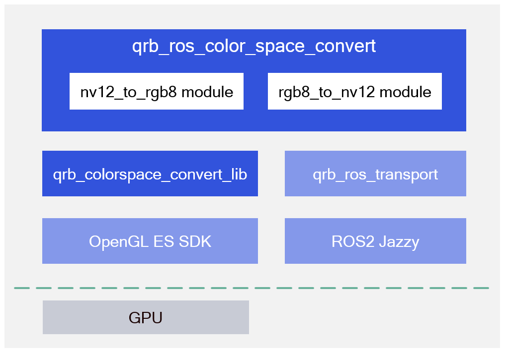

<div align="center">
  <h1>QRB ROS Color Space Conversion</h1>
  <p align="center">
    
  </p>
  <p>Performs conversion between NV12 and RGB888 formats</p>

  <a href="https://ubuntu.com/download/qualcomm-iot" target="_blank"></a>
  <a href="https://docs.ros.org/en/jazzy/" target="_blank"></a>

</div>

---

## 👋 Overview

The `qrb-ros-color-space-convert` sample application implements the following:

- Provides ROS nodes
  - API to convert NV12 to RGB888
  - API to convert RGB888 to NV12
- Supports `dmabuf` fd as input and output
- Input and output image receive and send with QRB ROS transport
- Hardware acceleration with GPU by OpenGL ES

<div align="center">
  
</div>


- The [`qrb_ros_color_space_convert`](https://github.com/qualcomm-qrb-ros/qrb_ros_color_space_convert) is a ROS2 package that includes two modules: nv12_to_rgb8 and rgb8_to_nv12. You can configure the conversion direction via parameter settings, enabling flexible bidirectional color space conversion.

- The [`qrb_colorspace_convert_lib`](https://github.com/qualcomm-qrb-ros/qrb_ros_color_space_convert/tree/main/qrb_colorspace_convert_lib) leverages the OpenGLES API to accelerate color space conversion using GPU.

- The [`qrb_ros_transport`](https://github.com/qualcomm-qrb-ros/qrb_ros_transport) is a ROS 2 package, it supports zero-copy image transport with Linux DMA buffer and implements ROS type adaption, make it compatible with both intra- and inter-process communication.


## 🔎 Table of Contents

  * [APIs](#-apis)
  * [Supported Targets](#-supported-targets)
  * [Installation](#-installation)
  * [Usage](#-usage)
  * [Build from Source](#-build-from-source)
  * [Contributing](#-contributing)
  * [Contributors](#%EF%B8%8F-contributors-optional)
  * [FAQs](#-faqs-optional)
  * [License](#-license)

## ⚓ APIs

### 🔹 `qrb_ros_color_space_convert` APIs

#### ROS interfaces

<table>
  <tr>
    <th>Interface</th>
    <th>Name</th>
    <th>Type</th>
    <td>Description</td>
  </tr>
  <tr>
    <td>Subscriber</td>
    <td>/image_raw</td>
    <td>qrb_ros::transport::type::Image</td>
    <td>input image</td>
  </tr>
  <tr>
    <td>Publisher</td>
    <td>/image</td>
    <td>qrb_ros::transport::type::Image</td>
    <td>output image</td>
  </tr>
</table>

#### ROS parameters

<table>
  <tr>
    <th>Name</th>
    <th>Type</th>
    <th>Description</td>
    <th>Default Value</td>
  </tr>
  <tr>
    <td>conversion_type</td>
    <td>string</td>
    <td>Conversion type</td>
    <td>nv12_to_rgb8</td>
  </tr>
  <tr>
    <td>latency_fps_test</td>
    <td>bool</td>
    <td>Enable or disable latency FPS test</td>
    <td>true</td>
  </tr>

</table>


### 🔹 `qrb_colorspace_convert_lib` APIs

<table>
  <tr>
    <th>Function</th>
    <th>Parameters</th>
    <th>Description</th>
  </tr>
  <tr>
    <td>bool nv12_to_rgb8(int in_fd, int out_fd, int width, int height)</td>
    <td>
      in_fd – input DMA_BUF file descriptor<br>
      out_fd – output DMA_BUF file descriptor<br>
      width – image width, must align with GPU supported size<br>
      height – image height, must align with GPU supported size
    </td>
    <td>Convert NV12 to RGB8</td>
  </tr>
  <tr>
    <td>bool rgb8_to_nv12(int in_fd, int out_fd, int width, int height)</td>
    <td>
      in_fd – input DMA_BUF file descriptor<br>
      out_fd – output DMA_BUF file descriptor<br>
      width – image width, must align with GPU supported size<br>
      height – image height, must align with GPU supported size
    </td>
    <td>Convert RGB8 to NV12</td>
  </tr>
</table>


## 🎯 Supported targets

<table >
  <tr>
    <th>Development Hardware</th>
    <td>Qualcomm Dragonwing™ RB3 Gen2</td>
    <td>Qualcomm Dragonwing™ IQ-9075 EVK</td>
  </tr>
  <tr>
    <th>Hardware Overview</th>
    <th><a href="https://www.qualcomm.com/developer/hardware/rb3-gen-2-development-kit"></a></th>
    <th><a href="https://www.qualcomm.com/products/internet-of-things/industrial-processors/iq9-series/iq-9075"></a></th>
  </tr>
</table>

---

## ✨ Installation

> [!IMPORTANT]
> **PREREQUISITES**: The following steps need to be run on **Qualcomm Ubuntu** and **ROS Jazzy**.<br>
> - **Qualcomm Ubuntu**:
> Reference [Install Ubuntu on Qualcomm IoT Platforms](https://ubuntu.com/download/qualcomm-iot) to install Ubuntu Server(Ubuntu Desktop is not supported because Weston is not available)<br>
> - **ROS Jazzy**: [Install ROS Jazzy](https://docs.ros.org/en/jazzy/index.html) to setup environment. <br>
> - For Qualcomm Linux, please check out the [Qualcomm Intelligent Robotics Product SDK](https://docs.qualcomm.com/bundle/publicresource/topics/80-70018-265/introduction_1.html?vproduct=1601111740013072&version=1.4&facet=Qualcomm%20Intelligent%20Robotics%20Product%20(QIRP)%20SDK) documents.

Add Qualcomm IOT PPA for Ubuntu:

```bash
sudo add-apt-repository ppa:ubuntu-qcom-iot/qcom-ppa
sudo add-apt-repository ppa:ubuntu-qcom-iot/qirp
sudo apt update
```

Install Debian package:

```bash
sudo apt install ros-jazzy-qrb-ros-colorspace-convert
```

## 🚀 Usage
You need to develop two ROS 2 nodes:
 - **Image Publisher Node**: This node is responsible for publishing image data to a ROS topic. It serves as the source of input images for the color space conversion process.
 - **Subscriber Node for `qrb_ros_color_space_convert` Output**: This node subscribes to the output topic of the `qrb_ros_color_space_convert` package. It processes the converted image data—either from NV12 to RGB8 or vice versa—based on the selected conversion mode.

### Launch qrb_ros_color_space_convert node

```bash
source /opt/ros/jazzy/setup.bash

# convert color space from NV12 to RGB888
ros2 launch qrb_ros_colorspace_convert colorspace_convert.launch.py 'conversion_type:=nv12_to_rgb8' 'latency_fps_test:=False'

# convert color space from RGB888 to NV12
ros2 launch qrb_ros_colorspace_convert colorspace_convert.launch.py 'conversion_type:=rgb8_to_nv12' 'latency_fps_test:=False'
```

The output for these commands:

```bash
[INFO] [launch]: All log files can be found below /opt/.ros/log/1980-01-06-00-15-37-706654-qcs6490-rb3gen2-vision-kit-4007
[INFO] [launch]: Default logging verbosity is set to INFO
[INFO] [component_container-1]: process started with pid [4027]
[component_container-1] [INFO] [0315965738.248046048] [component_colorconvert_container]: Load Library: /usr/lib/libqrb_ros_colorspace_convert.so
[component_container-1] [INFO] [0315965738.255523704] [component_colorconvert_container]: Found class: rclcpp_components::NodeFactoryTemplate<qrb_ros::colorspace_convert::ColorspaceConvertNode>
[component_container-1] [INFO] [0315965738.255619694] [component_colorconvert_container]: Instantiate class: rclcpp_components::NodeFactoryTemplate<qrb_ros::colorspace_convert::ColorspaceConvertNode>
[INFO] [launch_ros.actions.load_composable_nodes]: Loaded node '/colorspace_convert_node' in container '/component_colorconvert_container'
[component_container-1] QUALCOMM build                   : c818648474, I49ad18b9ef
[component_container-1] Build Date                       : 07/02/25
[component_container-1] OpenGL ES Shader Compiler Version:
[component_container-1] Local Branch                     :
[component_container-1] Remote Branch                    :
[component_container-1] Remote Branch                    :
[component_container-1] Reconstruct Branch               :
[component_container-1] Build Config                     : G ESX_C_COMPILER_OPT 3.3.0 AArch64
[component_container-1] Driver Path                      : /usr/lib/libGLESv2_adreno.so.2
[component_container-1] Driver Version                   : 0808.10
[component_container-1] Process Name                     : component_container
[component_container-1] QIPL gbm_create_Device=33
[component_container-1] QIPL utils gbm device renderd128 fd=-1255206912
[component_container-1] PFP: 0x016dc112, ME: 0x00000000
[component_container-1] Pre-rotation disabled !!!
[component_container-1] Get HANDLE[1] from fd[31]
[component_container-1] Get fd[36] from GEM HANDLE[1]
[component_container-1] Get HANDLE[2] from fd[32]
[component_container-1] Get fd[36] from GEM HANDLE[2]
[component_container-1] GEM Handle for BO=1 closed
[component_container-1] GEM Handle for BO=2 closed
[component_container-1] Get HANDLE[1] from fd[32]
[component_container-1] Get fd[31] from GEM HANDLE[1]
[component_container-1] Get HANDLE[2] from fd[36]
[component_container-1] Get fd[31] from GEM HANDLE[2]
[component_container-1] GEM Handle for BO=1 closed
[component_container-1] GEM Handle for BO=2 closed
...
```

Use the following command to confirm the color space conversion Result.

```bash
ros2 topic echo /image_raw | grep "encoding"
ros2 topic echo /image | grep "encoding"
```

---

## 👨‍💻 Build from Source

Install dependencies
```
sudo apt install ros-jazzy-qrb-ros-transport-image-type
sudo apt install ros-jazzy-qrb-ros-transport-point-cloud2-type
sudo apt install ros-jazzy-qrb-ros-transport-imu-type
sudo apt install ros-jazzy-pcl-conversions
sudo apt install qcom-adreno-dev
sudo apt install weston
sudo apt install weston-autostart # reboot is required for Weston to start automatically
```
Download the source code and build with colcon
```
source /opt/ros/jazzy/setup.bash
git clone https://github.com/qualcomm-qrb-ros/qrb_ros_color_space_convert.git
colcon build
```

Run and debug
```
source install/setup.bash

# convert color space from NV12 to RGB888
ros2 launch qrb_ros_colorspace_convert colorspace_convert.launch.py 'conversion_type:=nv12_to_rgb8' 'latency_fps_test:=False'

# convert color space from RGB888 to NV12
ros2 launch qrb_ros_colorspace_convert colorspace_convert.launch.py 'conversion_type:=rgb8_to_nv12' 'latency_fps_test:=False'
```


## 🤝 Contributing

We love community contributions! Get started by reading our [CONTRIBUTING.md](CONTRIBUTING.md).  
Feel free to create an issue for bug reports, feature requests, or any discussion 💡.

## ❤️ Contributors

Thanks to all our contributors who have helped make this project better!

<table>
  <tr>
    <td align="center"><a href="https://github.com/violet227"><br /><sub><b>violet227</b></sub></a></td>
    <td align="center"><a href="https://github.com/penww"><br /><sub><b>penww</b></sub></a></td>
    <td align="center"><a href="https://github.com/jiaxshi"><br /><sub><b>jiaxshi</b></sub></a></td>
    <td align="center"><a href="https://github.com/quic-zhaoyuan"><br /><sub><b>quic-zhaoyuan</b></sub></a></td>
  </tr>
</table>

## ❔ FAQs

<details>
<summary>Do I need to do additional development for the pipeline?</summary><br>
Yes, you’ll need to implement a ROS node to publish images, as well as a subscriber node to process the output from the color space conversion node.
</details>

## 📜 License

Project is licensed under the [BSD-3-Clause](https://spdx.org/licenses/BSD-3-Clause.html) License. See [LICENSE](./LICENSE) for the full license text.
